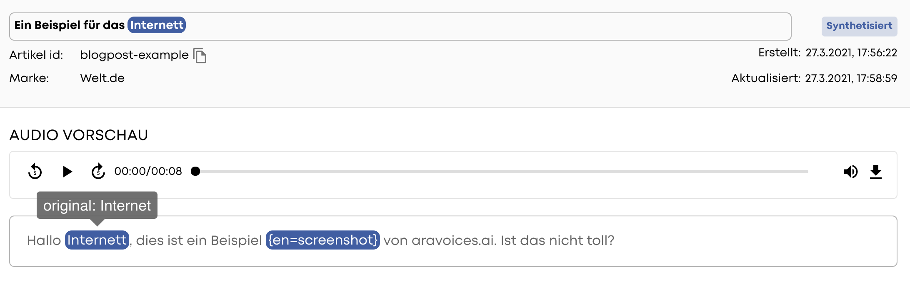
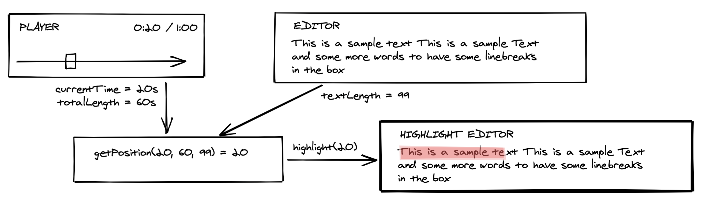
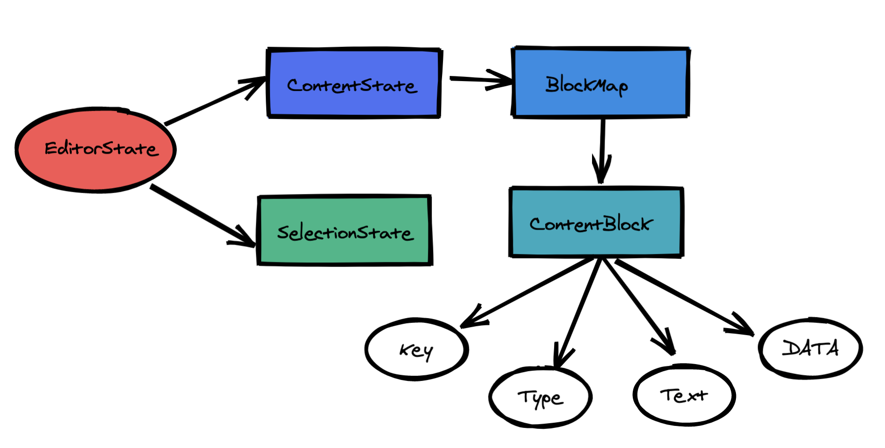
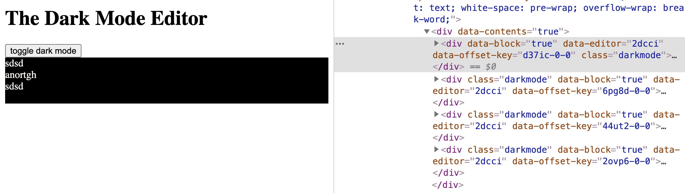

Implementing an audio tracking enabled editor using draft.js
============================================================

Aravoices.ai is a service that allows customers to synthesize written articles into an audio file 
using custom voices. Think Alexa reading you an article but using your 'brand' specific voice. 
If you listen to one of the many articles published by the newspaper welt.de, you listen to 
a product of aravoices.ai.

The synthesis is done using a mix of trained ai-models which take the article to read as an input. 
Go to XXXX /* add link */ to find out more about the ai part, driving the synthesis. Back to text! When reading 
out an article, some words are not pronounced the way they are written. For example the German 
word "Weg" for path and the adverb "weg" meaning away. To fine tune the voice we at aravoices.ai 
give the customer a quality-control dashboard where she/he can adjust the pronunciation of 
certain words if needed.



Now, imaging proof-listening an article using the written article as a reference with hundreds of words. 
You most likely lose track. To aid the customer we want to give an indication where the current audio 
position is relative to the text, similar to subtitles while watching a video.

__Challenge Accepted. Let's start ~~Coding~~ drawing!__



The Idea is simple: Have the audio player tell the text editor the current audio position and let the text editor 
do the highlighting. One could highlight the current character, the word or current paragraph. To convert 
the current audio position to a position in the text, we will be using the following magic position 
conversion formula:

```js
// getPosition returns the relative text position to audio position in relation to audio length
export const getPosition = (audioPosition, audioLength, textLength) => {
      const audioProgressPercentage = (audioPosition / audioLength) * 100;
      return Math.ceil(textLength * audioProgressPercentage / 100);
  }
``` 

The audio html ```<audio/>``` element enables playing sound files on the web. To read about it, head over to 
the [mdn reference for the audio element](https://developer.mozilla.org/en-US/docs/Web/HTML/Element/audio). 
The element provides you with a couple of interesting events and properties that we need in order to track the progress:

```js
const soundFile =
  "https://upload.wikimedia.org/wikipedia/commons/c/c8/Example.ogg";

const initialAudioState = {
  length: 0,
  position: 0
};

export const AudioPlayer = () => {
  const [playerState, setPlayerState] = useState(initialAudioState);

  /* fires when data has been loaded and the audio player knows what's what */
  const handleLoadedMetadata = (evt) => setPlayerState({...playerState, length: evt.target.duration });

  /* fires when the playing time has updated due to playing the audio or seeking */
  const handleTimeUpdate = (evt) => setPlayerState({ ...playerState, position: evt.target.currentTime });

  return (
    <div>
      <audio
        controls
        onLoadedMetadata={handleLoadedMetadata}
        onTimeUpdate={handleTimeUpdate}>
        <source src={soundFile} type="audio/ogg"></source>
      </audio>

      <div>Length: {playerState.length}</div>
      <div>Position: {playerState.position}</div>
    </div>
  );
};
```
In the above example you see how to get data from the player into a react component ```<AudioPlayer\>``` 
using the events provided by the audio element. Once the audio file has been loaded, the audio element 
informs interested parties about details on the audio file. Whenever the playback time changes, the audio 
element emits an ```TimeUpdate``` event which we can use. Getting the current audio playing time using the 
```currentTime``` property of the audio element was not so hard after all. We save everything in the 
component's own state.

To get fine grain control of the update frequency one could use the ```setInterval``` function for polling instead. 
If you need a more stable polling frequency one could use the [requestAnimationFrame function instead](https://stackoverflow.com/questions/34766476/how-to-lock-fps-with-requestanimationframe). 
The event fired by the audio element is good enough for me.

The next challenge is letting the editor know about the current audio position, estimating the position in the 
text and highlighting the corresponding paragraph. For the editor we will be using the [draft.js package provided by Facebook](https://draft.js).

Draft.js has an immutable internal model called the *EditorState*. It contains one model holding all the information about 
the current selection, and the other more interesting one is the *ContentState*. Draftjs converts text into __blocks__ 
depending on how to render it. You can attach data to a block and define a type. We will be using the block, and the 
__type property__ to 'style' the current text block relative to the audio position.



Let's start by a toy example changing all blocks to a 'dark-mode': Inverting the text color and background color of 
the editor's content whenever the user clicks the button. The ```<Editor/>``` component is provided by draftjs and 
provides us with a textarea allowing the user to enter text. To avoid race conditions, the draftjs tutorial page 
tells us to do any external editorState change via the [onChange handler](https://draftjs.org/docs/advanced-topics-editorstate-race-conditions/), 
which we are doing by using React's useState hook. We have another state holding the boolean whether the dark-mode 
is enabled or not. 

The only thing missing is telling draftjs what class to apply when a block has the type 'styled'. For that we are using 
our own custom blockStyle render function ```blockStyleHandler``` and tell draftjs to use it by passing it to the 
property ```blockStyleFn``` of the editor component.

```js
export const DarkModeEditor = () => {
    const [darkMode, setDarkMode] = useState(false);
    const [editorState, setEditorState] = useState(() => EditorState.createEmpty());

    /* listen to the button change, apply the dark mode and inform draftjs to update the editorState */
    useEffect(() => {
        let newEditorState = toggleDarkMode(darkMode, editorState);
        handleOnChange(newEditorState);
    }, [darkMode]);

    /* will be called when things change, we can call it as well */
    const handleOnChange = (editorState) => setEditorState(editorState);
    const blockStyleHandler = (contentBlock) => {
        if (contentBlock.getType() === 'styled') return 'darkmode';
    }
    return <div>
            <button onClick={() => setDarkMode(!darkMode)}>toggle dark mode</button>
            <Editor editorState={editorState}
                    onChange={handleOnChange}
                    blockStyleFn={blockStyleHandler} // we use our own blockStyle render function
            />
        </div>;
}
```

Whenever the user clicks the toggle dark mode button the function ```toogleDarkMode``` is being called with two arguments: 
the current darkmode flag and the current editorState. When we want to toggle the darkmode we want to mutate the current 
editorState, namely change each block type and create a new editorState which we hand back to the previously 
mentioned ```onChange``` handler.

Once you understand that draftjs is using an immutable data model behind the scenes it becomes clear that the only way 
to 'change' something you have to create a new state based on the existing one. In our ```toggleDarkMode``` function we take 
the current editorState, iterate over all blocks and modify each block type. Once we are done, we create a 
new editorState, reset the selectionState to the original one and hand back the final 'merged' editorState.

```js  
const toggleDarkMode = (darkModeEnabled, editorState) => {
    /* save the current selection to restore it after applying our dark mode */
    let originalSelection = editorState.getSelection();

    let contentState = editorState.getCurrentContent();
    let blockStyle = darkModeEnabled ? 'styled' : 'unstyled';

    /* now we go over all blocks, select each block and modify the style */
    editorState.getCurrentContent()
        .getBlockMap()
        .forEach(block => {
            const blockSelection = SelectionState.createEmpty(block.getKey());
            contentState = Modifier.setBlockType(contentState, blockSelection, blockStyle);
            EditorState.push(editorState, contentState, 'change-block-data');
        });

    /* merge our styling changes onto the existing editor state and reset the selection */
    EditorState.push(editorState, contentState, 'change-block-data');
    return EditorState.acceptSelection(editorState, originalSelection);
}
```
When you run the example and check the style applied to the blocks in the developer console you see that each 
block gets the darkmode class once you hit that toggle button.



Nice. Whenever draftjs registers a change in the content, it updates its internal model, applies our darkMode 
toggle function, applies the class and renders the result. Darkmode check!

__Now on to the big finale.__

We know how to calculate the current audio position and how to calculate the character position using our 
```getPosition()``` function. And we know how to apply a CSS class to a block of content. Time to connect the 
dots. Luckily we have everything in place and only need to change the way we decide when to apply the style 
to a block or not. Let me introduce to you the ```highlightText()``` function:

```js
    const highlightText = (audioPosition, editorState) => {
        let selection = editorState.getSelection();

        let characterCount = 0;
        let blockSize = editorState.getCurrentContent().getBlockMap().size;
        let state = editorState.getCurrentContent();

        editorState.getCurrentContent()
            .getBlockMap()
            .forEach(block => {
                let blockTextLength = block.getText().length;
                let blockStyle = 'unstyled';

                if (audioPosition > characterCount && audioPosition <= (characterCount + blockTextLength + blockSize - 1)) {
                    blockStyle = 'styled';
                }
                characterCount += blockTextLength;
                state = Modifier.setBlockType(state, SelectionState.createEmpty(block.getKey()), blockStyle);
            });

        let styledState = EditorState.push(editorState, state, 'change-block-data', false);
        return EditorState.acceptSelection(styledState, selection);
    }
```
Checkout the example. We now got an editor allowing the user to edit the text, while highlighting roughly the 
current audio position by highlighting the paragraph/block.

__Success!__


Yes, our solution is not the best in terms of audio position percision but good enough to give the proof reading person a 
rough indication where she/he is. One could ask the backend to send a more precise audio position information along with the text. 
But first let us see how far we get with our current implementation.

*If you are based in Berlin, or want to, and are interested in working with passionate developers, drop us an email at hello@asideas.de :-)*
